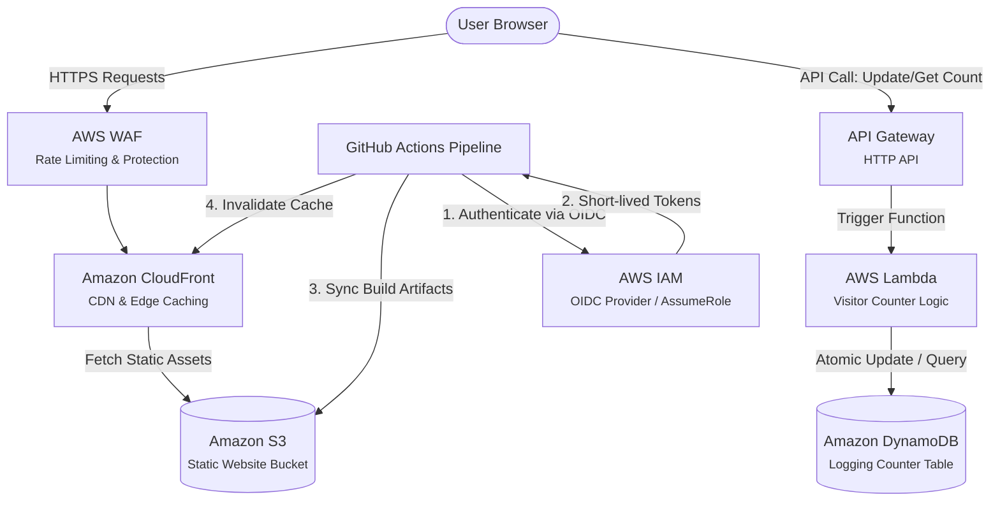

## Live at [aleksandermatusik.xyz](https://aleksandermatusik.xyz)

Welcome to the repository for my cloud-native, serverless portfolio website. This project showcases a fully automated, secure, and highly scalable static website hosted on AWS, featuring a real-time serverless visitor counter backend.

---

## Architecture

The following diagram illustrates the end-to-end architecture of the portfolio application, covering the frontend hosting, backend metrics tracking, security layers, and the CI/CD deployment pipeline.

---

## How It Works
# Frontend Delivery & Security

    When a user visits aleksandermatusik.xyz, the traffic passes through AWS WAF (Web Application Firewall) to filter out common web exploits, bots, and rate-limit aggressive requests.

    The request hitting Amazon CloudFront is served from the nearest Edge Location. If the static assets (HTML, CSS, JS, images) are cached, they are returned instantly. If not, CloudFront fetches them securely from an Amazon S3 bucket.

# Dynamic Visitor Counter Backend

    As the portfolio page loads in the user's browser, an asynchronous JavaScript fetch() request is initiated toward Amazon API Gateway (HTTP API).

    API Gateway acts as the thin entry point, routing the request directly to an AWS Lambda function.

    The Lambda function executes single-purpose code to communicate with Amazon DynamoDB. It executes an atomic update operation (UpdateItem) to increment the visitor counter record and log the transaction, returning the updated count back through the API gateway to update the DOM dynamically.

# CI/CD Deployment Flow

    When code is pushed to the main branch of this GitHub repository, a GitHub Actions workflow triggers.

    Instead of storing permanent AWS credentials in GitHub, the pipeline uses an IAM OIDC Identity Provider to securely assume a specific AWS IAM Role using short-lived tokens.

    The workflow builds the frontend files, synchronizes them with the S3 Bucket, and issues a CloudFront Cache Invalidation so that global users see the updates immediately.

# Architecture Decisions

    HTTP API over REST API: Selected API Gateway HTTP APIs instead of REST APIs because they offer up to 70% lower latency and are significantly more cost-effective for a lightweight, serverless portfolio backend.

    OIDC Authentication for GitHub Actions: Avoided long-lived IAM user Access Keys/Secret Keys inside GitHub Secrets. Utilizing OpenID Connect (OIDC) establishes a trust relationship between GitHub and AWS, executing deployments safely via dynamic, short-lived STS credentials.

    WAF Integration at Edge: Implemented AWS WAF directly on the CloudFront distribution. Even for a personal portfolio website, applying basic rate-limiting prevents sudden cost spikes driven by malicious scrapers or denial-of-service attempts.

    DynamoDB Global Scale & Single-Table Design: Opted for DynamoDB due to its seamless serverless model (pay-per-request / On-Demand capacity). The visitor tracker uses a single item with atomic attributes to eliminate race conditions during high concurrent traffic spikes.

# Services Used

    Amazon S3: Hosts the static website frontend assets securely with all public access blocked natively at the bucket level.

    Amazon CloudFront: Acts as the Global Content Delivery Network (CDN) enforcing strict HTTPS and caching files globally.

    AWS WAF (Web Application Firewall): Mitigates web exploits and monitors inbound traffic parameters.

    Amazon API Gateway (HTTP API): Provides a low-latency, CORS-configured RESTful endpoint for frontend integration.

    AWS Lambda: Executes serverless business logic for parsing hits and modifying database states without running continuous servers.

    Amazon DynamoDB: Serves as a NoSQL database storing persistent tracking data reliably.

    AWS IAM: Enforces the Principle of Least Privilege across granular execution roles for Lambda and the GitHub deployment pipeline.

---

## Problems I Encountered
1. Cross-Origin Resource Sharing (CORS) Issues
Initial async fetch calls from the portfolio frontend to the API Gateway endpoint were blocked by browser safety protocols with a missing Access-Control-Allow-Origin header error. Configured CORS rules directly within the API Gateway HTTP API settings to explicitly allow traffic origin from https://aleksandermatusik.xyz and specify permitted methods (GET, POST, OPTIONS).

2. IAM OIDC Sub-Claim Scoping Misconfiguration
The GitHub Actions pipeline failed during the authentication step (AssumeRoleWithWebIdentity). The IAM Role trust relationship policy was initially scoped too broadly or contained typos in the federated subject claim (sub). Refined the IAM Role Trust Policy condition block to evaluate precisely against the repository name and branch string format: token.actions.githubusercontent.com:sub": "repo:matusikal/portfolio:ref:refs/heads/main".

3. CloudFront Stale Content Post-Deploy
After successful GitHub Action deployments to S3, changes on the live domain did not reflect immediately because CloudFront continued serving cached assets from Edge locations. Added an automated step at the end of the GitHub Actions workflow to programmatically issue a CloudFront cache invalidation command (aws cloudfront create-invalidation --distribution-id <id> --paths "/*") immediately following the S3 sync phase.

## What I'd Add Next

    Infrastructure as Code (IaC): Migrate manual console configuration completely into AWS CDK (Cloud Development Kit) or Terraform to enable modular, repeatable infrastructure environments.

    Geo-Location Traffic Tracking: Modify the Lambda function to extract geolocation headers supplied by CloudFront (CloudFront-Viewer-Country) to log aggregate regional visitor metrics inside DynamoDB.

    Enhanced Monitoring & Dashboarding: Configure Amazon CloudWatch Alarms to trigger email or Slack alerts via Amazon SNS if API Gateway errors surge or if AWS WAF drops excessive requests.

Automated Testing: Implement integration testing workflows in GitHub Actions using tools like Cypress to validate the UI and backend functionality on a staging domain before merging to production.
   
---