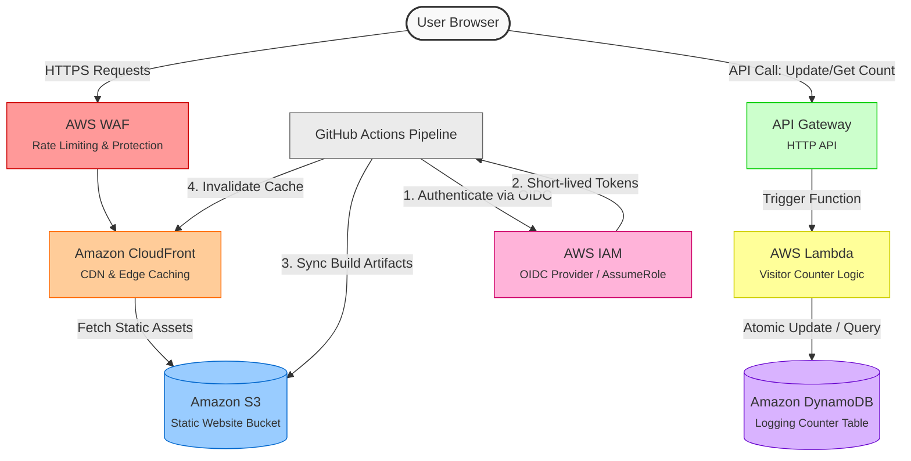

readme_content = """# AWS Portfolio Website

## Live at [aleksandermatusik.xyz](https://aleksandermatusik.xyz)

Welcome to the repository for my cloud-native, serverless portfolio website. This project showcases a fully automated, secure, and highly scalable static website hosted on AWS, featuring a real-time serverless visitor counter backend.

---

## Architecture

The following diagram illustrates the end-to-end architecture of the portfolio application, covering the frontend hosting, backend metrics tracking, security layers, and the CI/CD deployment pipeline.

